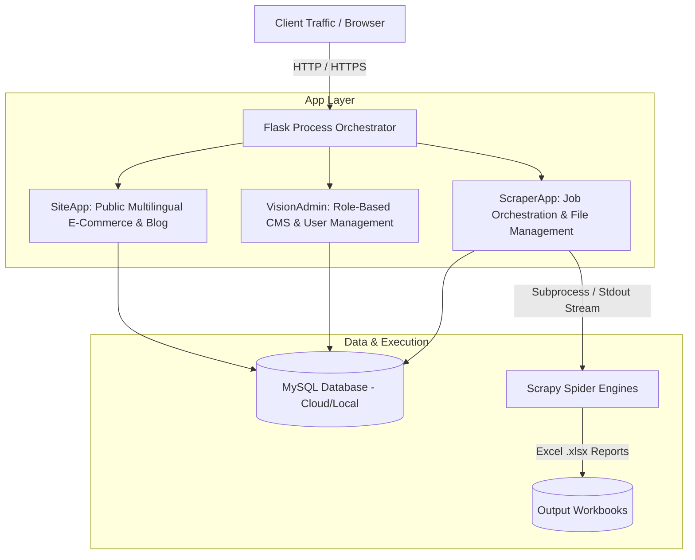
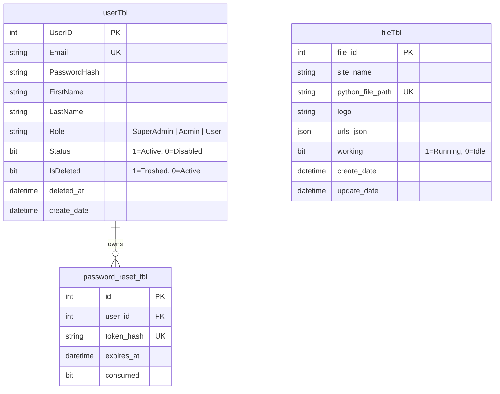

# 🛠️ TyresVision & Scraper Dashboard — Tech Stack Guide

A complete technical specification, architectural blueprint, and comprehensive library guide for the **TyresVision** e-commerce platform and its integrated **Scraper & File Management Engine**.

---

## 📑 Table of Contents
1. [System Overview](#-system-overview)
2. [Complete Library & Package Manifest](#-complete-library--package-manifest)
   - [A. Web Framework & Application Core](#a-web-framework--application-core)
   - [B. Database & Connection Pooling](#b-database--connection-pooling)
   - [C. Security, Authentication & Cryptography](#c-security-authentication--cryptography)
   - [D. Email & Communication](#d-email--communication)
   - [E. Scraping, Headless Browsers & Anti-Bot Automation](#e-scraping-headless-browsers--anti-bot-automation)
   - [F. Data Processing & Excel Generation](#f-data-processing--excel-generation)
   - [G. System Monitoring & Utilities](#g-system-monitoring--utilities)
   - [H. Frontend Libraries & Client-Side Dependencies](#h-frontend-libraries--client-side-dependencies)
3. [Backend Architecture](#-backend-architecture)
4. [Frontend Architecture & Design System](#-frontend-architecture--design-system)
5. [Database & Data Models](#-database--data-models)
6. [Scraping Pipeline & Subprocess Engine](#-scraping-pipeline--subprocess-engine)
7. [Internationalization & RTL (i18n)](#-internationalization--rtl-i18n)
8. [Security & Authentication](#-security--authentication)
9. [Deployment & Infrastructure](#-deployment--infrastructure)
10. [Developer Quick Start & Commands](#-developer-quick-start--commands)

---

## 🌐 System Overview

The application is structured into three primary functional sub-systems running within a unified Python/Flask ecosystem:



---

## 📦 Complete Library & Package Manifest

Below is the complete list of all third-party libraries, Python packages, and client-side dependencies used to develop and run the application.

### A. Web Framework & Application Core
| Package / Library | Version | Purpose in Application |
| :--- | :--- | :--- |
| **`Flask`** | `3.1.3` | Primary WSGI web framework providing routing, blueprint modularity (`siteapp`, `visionadmin`, `scraperapp`), and session cookies. |
| **`Werkzeug`** | `3.1.8` | WSGI utility library, HTTP request/response pipeline, secure password generation, and `secure_filename()` file sanitization. |
| **`Jinja2`** | `3.1.6` | Server-side template rendering engine with template inheritance, macros, and multilingual blocks. |
| **`Flask-CKEditor`** | `1.0.0` | Rich WYSIWYG editor integration for authoring and formatting blog articles and custom CMS pages in VisionAdmin. |
| **`Flask-Compress`** | `1.24.0` | Gzip and Brotli compression for HTTP responses, drastically minimizing asset payloads and page load times. |
| **`python-dotenv`** | `1.2.2` | Automatically loads configuration and secrets from root `.env` file into `os.environ`. |
| **`waitress`** | `3.0.2` | Production-grade pure-Python WSGI server optimized for Windows Server and IIS environments. |
| **`gunicorn`** | `21.2.0` | High-performance UNIX/Linux WSGI HTTP server for production deployment. |

### B. Database & Connection Pooling
| Package / Library | Version | Purpose in Application |
| :--- | :--- | :--- |
| **`PyMySQL`** | `1.2.0` | Pure-Python MySQL database client for running secure parameterized SQL queries against `userTbl`, `fileTbl`, etc. |
| **`DBUtils`** | `3.1.2` | Provides thread-safe database connection pooling (`PooledDB`) for concurrent requests without connection leaks. |

### C. Security, Authentication & Cryptography
| Package / Library | Version | Purpose in Application |
| :--- | :--- | :--- |
| **`bcrypt`** | `5.0.0` | Adaptive cryptographic password hashing with built-in per-password salt generation. |
| **`cryptography`** | `50.0.0` | Underlying cryptographic engine used for SSL/TLS validation and secure token hashing. |
| **`itsdangerous`** | `2.2.0` | Cryptographic data signing for tamper-proof client-side Flask session cookies and CSRF tokens. |

### D. Email & Communication
| Package / Library | Version | Purpose in Application |
| :--- | :--- | :--- |
| **`smtplib` / `email`** | Python Built-in | Native standard library for delivering transactional password reset emails via secure SMTP (SSL 465 / STARTTLS 587). |

### E. Scraping, Headless Browsers & Anti-Bot Automation
| Package / Library | Version | Purpose in Application |
| :--- | :--- | :--- |
| **`Scrapy`** | `2.17.0` | Asynchronous crawling engine powering the standalone spiders (`pitstoparabiabycsv.py`, `pitstoparabia-brand-1.py`, `pitstoparabia-instock-3.py`). |
| **`playwright`** | `1.62.0` | Headless Chromium browser automation for dynamic single-page applications and JS-rendered DOMs. |
| **`curl_cffi`** | `0.16.0` | Specialized HTTP library that mimics real browser TLS/JA3/HTTP2 fingerprints to bypass Cloudflare bot protection. |
| **`lxml`** | `6.1.1` | C-based, high-performance HTML/XML parser used for lightning-fast XPath evaluations. |
| **`parsel`** | `1.11.0` | CSS and XPath selector engine built on top of lxml. |
| **`cssselect`** | `1.5.0` | Translates CSS3 selectors into XPath 1.0 expressions for Scrapy and Parsel. |
| **`requests`** | `2.34.2` | Standard synchronous HTTP client library for auxiliary URL checks and health verification. |
| **`tldextract`** | `5.3.1` | Accurately separates gTLDs, ccTLDs, and subdomains for smart scraper URL type classification. |

### F. Data Processing & Excel Generation
| Package / Library | Version | Purpose in Application |
| :--- | :--- | :--- |
| **`openpyxl`** | `3.1.5` | Reads, generates, styles, and concatenates multi-group tyre product `.xlsx` reports. |
| **`scrapy-xlsx`** | `0.1.1` | Scrapy item exporter for writing parsed products directly into formatted Excel sheets. |

### G. System Monitoring & Utilities
| Package / Library | Version | Purpose in Application |
| :--- | :--- | :--- |
| **`psutil`** | `7.2.2` | Process and system monitoring library used to track running spider subprocesses and server CPU/memory health. |
| **`tqdm`** | `4.70.0` | Visual CLI progress bar utility used in standalone scraper runs. |

### H. Frontend Libraries & Client-Side Dependencies
| Library / Framework | Source | Purpose in Application |
| :--- | :--- | :--- |
| **`Alpine.js 3.x`** | CDN | Declarative reactive UI framework managing mobile navigation drawers, modal sheets, filter pills, and live AJAX states. |
| **`@alpinejs/collapse`** | CDN | Alpine plugin enabling smooth spring-like CSS height transitions on FAQs and accordion dropdowns. |
| **`DataTables`** | CDN (`v1.13.6`) | Interactive client-side table sorting, pagination, and multi-field search for Admin User & File management. |
| **`DataTables Responsive`** | CDN (`v2.5.0`) | Ensures Admin data tables adapt fluidly to tablets and mobile screens. |
| **`jQuery`** | CDN (`v3.7.1`) | Foundation requirement for DataTables in the VisionAdmin dashboard. |
| **`Tailwind CSS`** | CDN | Utility CSS engine for styling the VisionAdmin internal management interfaces. |

---

## ⚙️ Backend Architecture

### 1. Process Orchestration (`app/app.py`)
- Single process entrypoint with modular Blueprints.
- Configures global Jinja template globals (`locale`, `site_locale`, `format_date`).
- Dynamically resolves `BASE_DIR` to the project root for seamless file access and report exports.

### 2. Multi-Tier Module Layout
- `app/auth.py`: User authentication, session guards (`@login_required_page`, `@login_required_api`), RBAC decorators (`@role_required_api`), and rate limiting.
- `app/db.py`: Central MySQL connection lifecycle provider via `python-dotenv`.
- `app/mailer.py`: Asynchronous email dispatcher via SMTP (SSL/TLS).
- `app/files_repo.py`: File & scraper registry CRUD logic.
- `app/file_scraper_runner.py`: Multi-threaded background process manager for registered scrapers.
- `app/scraper_input.py` & `app/scraper_status_utils.py`: URL analyzer and stdout line parser.

---

## 🎨 Frontend Architecture & Design System

### 1. Design Tokens & Visual Hierarchy
```css
:root {
  --green:        #58B31B;  /* Primary brand green */
  --green-bright: #68C927;  /* Hover / interactive highlights */
  --green-deep:   #35760F;  /* Accessible text green for white backgrounds */
  --green-tint:   #EFF9E6;  /* Soft green background badge wells */
  --ink:          #0E1108;  /* Primary dark ink / high-contrast black */
  --slate:        #4C5548;  /* Secondary readable neutral text */
  --line:         #E3E7DE;  /* Structural border lines */
  --bg:           #FFFFFF;  /* Primary canvas background */
  --bg-soft:      #F6F8F3;  /* Alternating section canvas */
  --radius:       14px;     /* Standard component curvature */
}
```

### 2. Layout & Motion Features
- **Sticky Glassmorphic Header**: Fixed top navigation with `-webkit-backdrop-filter: saturate(180%) blur(12px)` and shadow elevation.
- **RTL-Safe Viewports**: Uses `overflow-x: clip;` without breaking sticky positioning.
- **Micro-Interactions**: Smooth cubic-bezier spring curves (`cubic-bezier(0.16, 1, 0.3, 1)`).

---

## 🗄️ Database & Data Models



---

## 🕷️ Scraping Pipeline & Subprocess Engine

1. **Ad-Hoc Session Execution (`/StartScraper`)**:
   - Single-job per browser session (`session['sid']`).
   - Groups URLs into sub-batches based on detected scraper script.
   - Merges generated `.xlsx` parts into a unified downloadable report.
2. **Persistent Scraper Management (`/files`)**:
   - Manages up to 4 concurrent background worker threads (`MAX_CONCURRENT_SCRAPERS = 4`).
   - Persists status (`working = 1/0`) in `fileTbl`.

### Stdout Protocol
Spiders communicate progress in real time via standard stdout lines:
$$\text{URL\_STATUS} \mid \langle \text{url} \rangle \mid \langle \text{status} \rangle \mid \langle \text{parent} \rangle \mid \langle \text{type} \rangle$$

---

## 🌍 Internationalization & RTL (i18n)

- **Languages**:
  - 🇦🇪 **Arabic (`ar`)**: Right-to-Left (`dir="rtl"`), specialized typography and Arabic content.
  - 🇬🇧 **English (`en`)**: Left-to-Right (`dir="ltr"`).
- **Cookie & Path Routing**: `/ar/...` and `/en/...` with seamless switching and `site_locale` cookie persistence.

---

## 🚦 API Version Control & Semantic Versioning

The REST API implements standard semantic API version control:

- **Current Stable Version**: `1.0.0` (`v1`)
- **Version Manifest Endpoints**:
  - `GET /api/version` or `GET /api/v1/version`
  - `GET /visionadmin/api/version` or `GET /visionadmin/api/v1/version`
  - `GET /tcsadmin/api/version` or `GET /tcsadmin/api/v1/version`
- **Dual Route Binding**:
  - All endpoints support explicit versioning (`/api/v1/...`, `/visionadmin/api/v1/...`) alongside backward-compatible unversioned paths (`/api/...`, `/visionadmin/api/...`).
- **Standard Version Control Response Headers**:
  - `X-API-Version: 1.0.0`
  - `X-API-Release: v1`
  - `X-API-Status: active`
  - `X-API-Deprecation: none`
  - `X-API-Documentation: /api/v1/version`

---

## 🔒 Security & Guardrails

- **CSRF Defense**: `X-CSRF-Token` required on state-changing API endpoints.
- **Path Traversal Protection**: Uploaded scraper files are validated through `werkzeug.utils.secure_filename` and resolved strictly within `scrapers/`.
- **Brute-Force Throttling**: In-memory login attempt lockouts (5 failed attempts $\rightarrow$ 15-minute lock).

---

## 🚀 Deployment & Infrastructure

- **Windows**: Windows Server (2019/2022) with IIS + FastCGI / Waitress.
- **Linux**: Ubuntu 22.04+ LTS with Nginx reverse proxy + Gunicorn + Systemd service workers.
- **Database**: Railway MySQL Cloud or On-Premise MySQL 8.0+.

---

## 💻 Developer Quick Start

```bash
# 1. Activate virtual environment
venv\Scripts\activate

# 2. Install dependencies
pip install -r requirements.txt

# 3. Initialize database schema
python app/init_db.py

# 4. Create initial Admin user
python app/create_user.py

# 5. Launch development server
python app/app.py
```

---
*Maintained by the TyresVision Core Engineering Team.*
